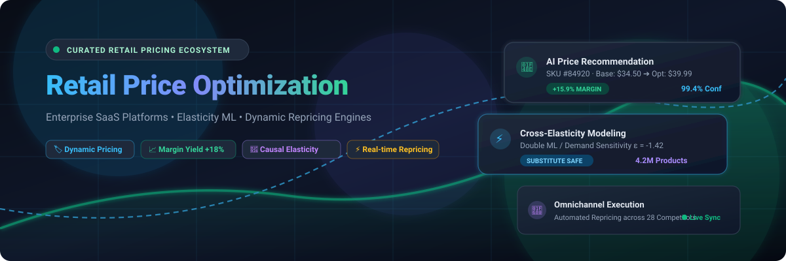
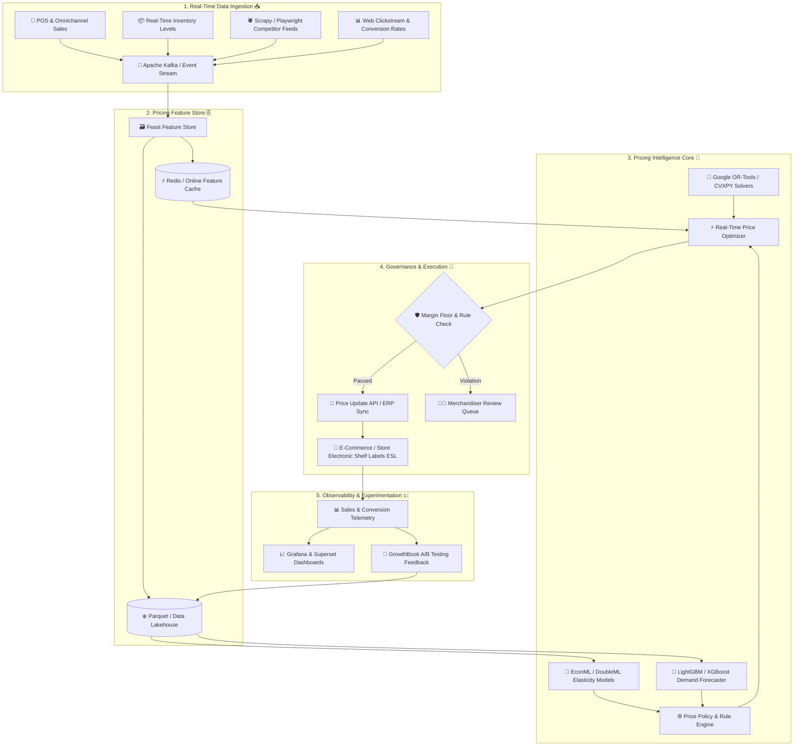

# 🏷️ Awesome Retail Price Optimization Platform Ecosystem

  

  
  
  
  
  
  
  

---

> 🚀 **A curated, battle-tested directory of enterprise SaaS solutions, open-source algorithms, machine learning models, and production architectural blueprints for AI-driven dynamic pricing, demand elasticity estimation, markdown optimization, and competitive price intelligence in retail and e-commerce.**

Last updated: September 2026 • Curated with ❤️ for pricing analysts, retail merchandisers, data scientists, revenue managers, and e-commerce operators.

---

## 📑 Table of Contents

- [🎯 Overview & Industry Scope](#-overview--industry-scope)
- [🏢 SaaS & Hosted Commercial Platforms](#-saas--hosted-commercial-platforms)
- [🧠 Open-Source GitHub Repositories & Libraries](#-open-source-github-repositories--libraries)
  - [🚀 Top Featured Open-Source Projects (Ranked by Stars)](#-top-featured-open-source-projects-ranked-by-stars)
  - [🤖 Machine Learning & Demand Forecasting](#-machine-learning--demand-forecasting)
  - [🎯 Causal Inference & Price Elasticity](#-causal-inference--price-elasticity)
  - [🧮 Mathematical Optimization & Constraint Solvers](#-mathematical-optimization--constraint-solvers)
  - [🎮 Reinforcement Learning & Dynamic Pricing Engines](#-reinforcement-learning--dynamic-pricing-engines)
  - [🕵️ Competitor Intelligence & Web Scraping](#️-competitor-intelligence--web-scraping)
  - [📊 BI, Dashboards & Pricing Feature Stores](#-bi-dashboards--pricing-feature-stores)
  - [🧪 Pricing Experimentation & A/B Testing](#-pricing-experimentation--ab-testing)
- [🏗️ Reference Architecture for Dynamic Pricing](#️-reference-architecture-for-dynamic-pricing)
- [🤝 How to Contribute](#-how-to-contribute)
- [📈 Star History](#-star-history)
- [⚖️ Disclaimer](#️-disclaimer)

---

## 🎯 Overview & Industry Scope

**Retail Price Optimization** represents the mission-critical intersection of **econometrics, machine learning, operations research, and real-time data engineering**. These systems empower omnichannel retailers, brands, and digital marketplaces to dynamically calculate profit-maximizing, revenue-optimal price points across millions of SKUs while protecting gross margins and brand integrity:

- 📊 **Price Elasticity Modeling**: Uncovering true unconfounded demand sensitivity using Double Machine Learning (DML) and econometric instrumentation.
- ⚡ **Real-Time Dynamic Repricing**: Adjusting prices instantaneously in response to stock depletion rates, competitor stockouts, conversion dips, and traffic velocity.
- 🏷️ **Markdown & Promotion Lifecycle Planning**: Timing promotional cadences and end-of-season clearance markdowns to liquidate aging inventory with maximal margin preservation.
- 🔍 **Competitive Price Intelligence**: Scraping and normalizing millions of competitive digital shelf data points to trigger automated, margin-safe repricing rules.
- 📦 **Cross-Elasticity & Cannibalization**: Modeling product substitutions and halo effects across multi-tier retail categories to prevent revenue leakage.

---

## 🏢 SaaS & Hosted Commercial Platforms

> 📊 **Market Size & Structure**: The global retail price optimization and dynamic pricing software market is estimated at **$2.2B – $2.9B+ (2025–2026)** and projected to exceed **$5.8B+ by 2031** (growing at an estimated **~15.2% CAGR**). The market is **moderately fragmented**—anchored on one end by large enterprise retail planning suites (such as Blue Yonder, RELEX, PROS, Zilliant, Pricefx, and Revionics) managing multi-echelon omnichannel inventory, and on the other end by a fast-growing ecosystem of agile dynamic-pricing and competitor-scraping SaaS tools (such as Competera, Omnia Retail, Prisync, Price2Spy, and Pricefy) serving digital-native and mid-market merchants.

*The table below is sorted by **Company Scale / Valuation / Revenue** in descending order:*

| Platform | Description | Company Scale / Valuation / Revenue | Pricing (Starting Tier) | Free Tier / Trial Limits |
| :--- | :--- | :--- | :--- | :--- |
| **[Blue Yonder Pricing](https://blueyonder.com/)** | Enterprise retail pricing and revenue management solution within the Blue Yonder supply chain suite for regular price, promotion, and markdown optimization. | **~$7.1B Valuation** (Panasonic subsidiary, ~$1.1B+ Annual Revenue) | Starts at **~$8,333/month** (~$100,000/year annual agreement) for entry-tier price and markdown optimization module; enterprise-wide deployments range from $250,000 to $1,000,000+/year. | No free forever plan; offers a **30-to-60-day guided value assessment pilot** with simulated retail supply chain and pricing elasticity scenarios upon enterprise sales qualification. |
| **[RELEX Solutions](https://www.relexsolutions.com/)** | Unified retail planning and supply chain platform delivering integrated demand forecasting, price optimization, and promotional/markdown planning. | **~$5.7B Valuation** (Blackstone-backed unicorn, ~$250M+ ARR) | Starts at **~$4,166/month** (~$50,000/year annual agreement) for modular mid-market retail price and markdown optimization; full enterprise deployments scale to $200,000–$1,000,000+/year. | No free forever plan; offers a **30-day guided proof-of-value simulation** utilizing historical retailer POS and inventory data upon enterprise sales qualification. |
| **[PROS Smart Price](https://pros.com/)** | Enterprise AI-powered pricing and revenue management platform supporting dynamic price guidance, revenue optimization, and omnichannel sales execution. | **~$1.6B Market Cap** (NYSE: PRO, ~$330M+ Annual Revenue) | Starts at **~$6,250/month** (~$75,000/year billed annually) for core price optimization and dynamic guidance modules; scales by transaction revenue volume. | No free forever plan; offers a **30-day guided evaluation sandbox** and opportunity analysis audit with historical transaction data upon enterprise sales qualification. |
| **[Zilliant](https://www.zilliant.com/)** | End-to-end price management and optimization software delivering AI-driven price elasticity, segmentation, and sales rep deal guidance for B2B and retail distribution. | **~$800M–$1.0B Valuation** (Madison Dearborn Partners, ~$100M+ Revenue) | Starts at **~$4,166/month** (~$50,000/year annual agreement) for core price management and guidance modules; scales by company transaction volume and user seats. | No free forever plan; offers a **30-day proof-of-value pilot** and historical transaction data elasticity audit upon enterprise sales qualification. |
| **[Pricefx](https://www.pricefx.com/)** | Cloud-native pricing platform offering modular price optimization, price setting, CPQ, rebate management, and real-time pricing analytics. | **~$500M–$600M Valuation** (Apax Digital / Series C, ~$70M+ ARR) | Starts at **~$8,333/month** (~$100,000/year annual subscription); foundational training and implementation packages start from €4,000–€10,500. | No free forever plan; offers a **30-day guided interactive sandbox demo** and proof-of-concept evaluation with customer catalog upload upon sales qualification. |
| **[Revionics](https://www.revionics.com/)** | Science-backed retail pricing platform leveraging machine learning to model consumer demand, optimize base prices, promotions, and markdown strategies. | **~$200M+ Valuation** (Acquired by Aptos / Goldman Sachs Merchant Banking, ~$50M+ Revenue) | Starts at **~$5,000/month** (~$60,000/year annual contract) for core retail base price optimization; scales based on store footprint, price zones, and SKU catalog size. | No free forever plan; offers a **30-day proof-of-value evaluation** / guided pricing simulation with historical retailer transaction data upon enterprise sales qualification. |
| **[Wiser Solutions](https://www.wiser.com/)** | Omnichannel commerce intelligence platform offering automated competitor repricing, MAP compliance monitoring, and retail catalog tracking. | **~$150M–$200M Valuation** (Quad-C / MidOcean Partners, ~$30M+ Revenue) | Starts at **$699/month** (~$8,388/year billed annually) for entry-tier online price monitoring, MAP compliance tracking, and catalog benchmarking. | No free forever plan; offers a **14-day guided trial / data audit** with sample competitor crawl and MAP compliance scan upon sales consultation. |
| **[Intelligence Node](https://www.intelligencenode.com/)** | Real-time retail intelligence and AI price tracking platform monitoring billions of SKUs across competitive digital storefronts and marketplaces. | **~$100M–$150M Valuation** (VC-backed, ~$20M+ ARR) | Starts at **$5,000/month** (~$60,000/year minimum engagement) for automated SKU tracking, competitive price feeds, and digital shelf analytics. | No free forever plan; offers a **14-day guided proof-of-concept trial** with a sample competitor crawl and digital shelf audit for up to 1,000 SKUs upon request. |
| **[Competera](https://competera.ai/)** | Retail dynamic pricing platform powered by deep learning that models cross-elasticity, demand forecasting, and competitive market signals. | **~$50M–$80M Valuation** (VC-backed Series A, ~$12M+ ARR) | Starts at **$750/month** for competitive price monitoring; enterprise AI dynamic pricing & demand elasticity modules start at **~$4,166/month** (~$50,000/year billed annually). | No free forever plan; offers a **30-day Proof of Concept (PoC) pilot** including historical sales data audit and live pricing recommendation sandbox upon qualification. |
| **[Omnia Retail](https://www.omniaretail.com/)** | Integrated retail pricing automation suite providing competitor price scraping, dynamic repricing algorithms, and Google Shopping bid adjustments. | **~$40M–$60M Valuation** (Acquired by Pricer AB, ~$12M+ Revenue) | Starts at **€399/month** (~$430/month) for SMB Single-Shop plan (AI price monitoring & dynamic repricing, up to 5 user seats); enterprise multi-shop plans start at ~€1,200/month. | No free forever plan; offers a **14-day guided trial / pilot** with competitor price scraping and dynamic repricing rule simulation for up to 500 SKUs upon demo request. |
| **[Prisync](https://prisync.com/)** | Competitor price tracking, monitoring, and dynamic repricing platform designed for e-commerce businesses, Shopify sellers, and multi-channel retailers. | **~$30M–$50M Valuation** (High-growth profitable SaaS, ~$10M+ ARR) | Starts at **$99/month** (Professional plan for up to 100 products, 3 daily updates; **$49/month** for Shopify stores); Premium tier at **$199/month** (1,000 products); Platinum at **$399/month** (5,000 products). | No free forever plan; **14-day free trial** with full feature access, tracking for up to 100 products, 3 daily price updates, and email notifications (no credit card required). |
| **[Price2Spy](https://www.price2spy.com/)** | Automated competitor price monitoring, price comparison, and dynamic repricing platform tailored for SMBs, e-commerce retailers, and manufacturers. | **~$20M–$30M Valuation** (Profitable bootstrapped SaaS, ~$7M+ ARR) | Starts at **$39.95/month** for Starter plan (monitoring up to 100 product URLs once daily); Basic plan starts at **$157.95/month** for up to 1,000 URLs with repricing module. | No free forever plan; **14-day free trial** with full feature access, tracking for up to 10 product URLs, email alerts, and report generation (no credit card required). |
| **[Yieldigo](https://www.yieldigo.com/)** | AI price optimization platform built for supermarkets, hypermarkets, drugstores, and retail chains modeling consumer baskets and elasticity. | **~$15M–$25M Valuation** (European VC-backed, ~$5M+ ARR) | Starts at **~$3,000/month** (~$36,000/year annual agreement) for core retail grocery/FMCG AI price optimization module; scales by store count and format complexity. | No free forever plan; offers a **30-day guided pilot / simulation** using historical transactional basket data to model category price elasticity upon sales qualification. |
| **[BlackCurve](https://www.blackcurve.com/)** | Pricing optimization and dynamic repricing software helping e-commerce sellers automate rules-based and margin-optimized pricing decisions. | **~$10M–$20M Valuation** (Mercia-backed, ~$3M–$5M Revenue) | Starts at **£199/month** (~$250/month billed annually) for Team plan (up to 5,000 SKUs, standard pricing rules, quotation builder); Professional plan starts at **£699/month**. | No free forever plan; **30-day free trial** providing access to Enterprise repricing features, rule engine simulations, and up to 5,000 SKUs. |
| **[Quicklizard](https://www.quicklizard.com/)** | Dynamic pricing and competitor-price monitoring platform designed for omnichannel retailers, brand manufacturers, and high-velocity e-commerce. | **~$10M–$20M Valuation** (Publicly listed TASE: QLIZ, ~$4M+ ARR) | Starts at **$3,300/month** (~$39,600/year) for core dynamic pricing platform, marketplace repricing, and competitor monitoring; scales by SKU count and calculation frequency. | No free forever plan; offers a **14-to-30-day guided proof-of-concept pilot** with custom pricing rule simulation on retailer's catalog upon sales qualification. |
| **[Symson](https://www.symson.com/)** | AI pricing platform that automates pricing workflows, combining competitor tracking, margin rules, and demand elasticity modeling. | **~$10M–$15M Valuation** (European VC-backed SaaS, ~$3M+ ARR) | Starts at **€997/month** (~$1,080/month flat rate) for core AI price optimization engine, competitor tracking, and margin rule execution. | No free forever plan; **14-day free trial** with custom product catalog onboarding, AI price recommendation sandbox, and elasticity preview. |
| **[Dealavo](https://dealavo.com/)** | AI-driven competitor price monitoring, dynamic repricing, and promotional intelligence platform for online retailers and consumer brands. | **~$8M–$15M Valuation** (European SaaS, ~$3M+ ARR) | Starts at **€220/month** (~$240/month) for core price monitoring and dynamic pricing automation; scales based on SKU count and competitor scraping frequency. | No free forever plan; **7-day free trial** with sample catalog analysis, automated competitor price scraping, and dynamic rule simulation on demo account. |
| **[Pricefy](https://pricefy.io/)** | Cloud-native competitor price monitoring, dynamic repricing, and product feed automation engine for e-commerce stores and omnichannel brands. | **~$5M–$10M Valuation** (Bootstrapped / seed-stage SaaS, ~$1.5M+ ARR) | **Free tier at $0/month**; Starter plan starts at **$49/month** ($37/month billed annually) for up to 100 SKUs; Pro tier with Dynamic Repricing starts at **$99/month** ($74/month billed annually) for up to 2,000 SKUs. | **Free forever plan** capped at **50 SKUs**, 5 competitors monitored, 1 daily price update, AI automatch, and 1 shopping feed channel (no credit card required). Also provides a **14-day free trial** of paid tiers. |

---

## 🧠 Open-Source GitHub Repositories & Libraries

*All repositories are ranked by **GitHub Star Count** in descending order. Each badge links directly to the repository's official stargazers page.*

### 🚀 Top Featured Open-Source Projects (Ranked by Stars)

1. **[Playwright](https://github.com/microsoft/playwright)**   
   ⚡ Fast, reliable headless browser automation for high-scale competitor price scraping, bot detection evasion, and multi-region e-commerce catalog crawling.

2. **[Grafana](https://github.com/grafana/grafana)**   
   📈 Open-source observability and analytics platform for real-time visualization of live price adjustments, profit margins, conversion rates, and revenue KPIs.

3. **[Apache Superset](https://github.com/apache/superset)**   
   📊 Enterprise-ready business intelligence platform and data exploration tool ideal for constructing rich pricing dashboards on top of SQL databases.

4. **[scikit-learn](https://github.com/scikit-learn/scikit-learn)**   
   🧠 Foundational Python machine learning library providing linear regressions, clustering, and preprocessing for baseline price elasticity and customer segmentation.

5. **[Scrapy](https://github.com/scrapy/scrapy)**   
   🕷️ Fast, high-level web crawling and scraping framework for asynchronous competitive price extraction and automated catalog monitoring pipelines.

6. **[Metabase](https://github.com/metabase/metabase)**   
   💡 Simple, intuitive business intelligence tool that lets pricing analysts explore margin distributions, competitor spreads, and revenue performance without SQL.

7. **[Ray RLlib](https://github.com/ray-project/ray)**   
   🌐 Distributed reinforcement learning library capable of training high-throughput dynamic pricing policies and multi-agent competitive market simulations.

8. **[XGBoost](https://github.com/dmlc/xgboost)**   
   ⚡ Optimized distributed gradient boosting library widely used as the workhorse for retail demand forecasting, price sensitivity modeling, and conversion rate prediction.

9. **[MLflow](https://github.com/mlflow/mlflow)**   
   🔄 Open-source MLOps platform for tracking price model experiments, managing versioned pricing models, and orchestrating automated retraining pipelines.

10. **[Prophet](https://github.com/facebook/prophet)**   
    📅 Time-series forecasting framework designed to handle strong seasonal effects, holidays, and trend shifts across historical retail sales data.

11. **[LightGBM](https://github.com/microsoft/LightGBM)**   
    🚀 Ultra-fast, tree-based gradient boosting framework optimized for high-volume SKU-level demand forecasting and non-linear price interaction features.

12. **[SciPy Optimize](https://github.com/scipy/scipy)**   
    🔬 Core numerical computation library providing nonlinear optimization, constraint minimization, and curve fitting for empirical revenue functions.

13. **[Optuna](https://github.com/optuna/optuna)**   
    🎯 Automatic hyperparameter optimization software for fine-tuning demand forecasting models, pricing policy parameters, and RL reward weights.

14. **[Google OR-Tools](https://github.com/google/or-tools)**   
    🧩 Fast mathematical optimization suite for linear, integer, and constraint programming to solve constrained commercial pricing, markdown schedules, and product bundling.

15. **[Stable-Baselines3](https://github.com/DLR-RM/stable-baselines3)**   
    🤖 Production-ready PyTorch implementations of reinforcement learning algorithms (PPO, DQN, SAC) for training autonomous dynamic pricing agents.

16. **[Gymnasium](https://github.com/Farama-Foundation/Gymnasium)**   
    🕹️ Standard API for reinforcement learning environments, providing the foundation for custom dynamic pricing simulation environments with stochastic customer demand.

17. **[Darts](https://github.com/unit8co/darts)**   
    ⏱️ Unified Python time-series library supporting classical ARIMA/ETS and deep learning models (N-BEATS, TFT) for multi-horizon retail demand forecasting.

18. **[CatBoost](https://github.com/catboost/catboost)**   
    🐱 Gradient boosting library with state-of-the-art native support for high-cardinality categorical features like Store IDs, SKU barcodes, and customer tiers.

19. **[GrowthBook](https://github.com/growthbook/growthbook)**   
    🧪 Open-source A/B testing and feature flagging platform for designing, executing, and statistically validating live pricing experiments and discount elasticity tests.

20. **[DoWhy](https://github.com/py-why/dowhy)**   
    🔍 Causal inference engine that isolates true price elasticity from confounders (promotions, seasonality, competitor actions) using causal graphical models.

21. **[Feast](https://github.com/feast-dev/feast)**   
    🗄️ Open-source feature store ensuring low-latency online serving and consistent offline training features (competitor prices, stock counts, elasticity scores) for real-time repricing.

22. **[CVXPY](https://github.com/cvxpy/cvxpy)**   
    📐 Domain-specific language for convex optimization, ideal for constrained multi-product price setting under margin floors, inventory ceilings, and business rules.

23. **[CausalML](https://github.com/uber/causalml)**   
    🎯 Uber's uplift modeling and causal ML toolkit for estimating heterogeneous treatment effects to personalize discounts, coupon allocations, and targeted promotion depth.

24. **[StatsForecast](https://github.com/Nixtla/statsforecast)**   
    ⚡ Lightning-fast statistical and econometric time-series models (AutoARIMA, ETS, CES) designed for massive parallel SKU demand forecasting.

25. **[EconML](https://github.com/py-why/EconML)**   
    🔬 Microsoft Research's causal machine learning library combining Double Machine Learning and instrumental variables to estimate non-linear price elasticity curves.

26. **[Pyomo](https://github.com/Pyomo/pyomo)**   
    ⚙️ Comprehensive Python-based mathematical optimization modeling language for complex linear, nonlinear, and mixed-integer price optimization problems.

27. **[PuLP](https://github.com/coin-or/pulp)**   
    📦 Clean linear programming library in Python that interfaces with popular solvers (CBC, GLPK, Gurobi, CPLEX) for commercial markdown and price formulation.

28. **[MLForecast](https://github.com/Nixtla/mlforecast)**   
    🌲 High-performance framework for recursive machine learning time-series forecasting across thousands of retail product hierarchies.

29. **[DoubleML](https://github.com/DoubleML/doubleml-for-py)**   
    ⚖️ Object-oriented Python library implementing Double Machine Learning to eliminate regularization bias when measuring causal price sensitivity and cross-elasticity.

30. **[dynamic-prices](https://github.com/normanrz/dynamic-prices)**   
    🍎 Open-source simulator and dynamic pricing engine designed specifically for perishable goods, markdown curves, and inventory-constrained clearance.

---

### 🤖 Machine Learning & Demand Forecasting
- **[LightGBM](https://github.com/microsoft/LightGBM)** & **[XGBoost](https://github.com/dmlc/xgboost)**: Tree-based gradient boosting models for non-linear demand curve estimation and SKU-level volume forecasting.
- **[CatBoost](https://github.com/catboost/catboost)**: Native categorical encoding for high-cardinality retail taxonomies (brand, department, shelf zone).
- **[Darts](https://github.com/unit8co/darts)** & **[StatsForecast](https://github.com/Nixtla/statsforecast)**: Econometric and deep time-series models for multi-horizon baseline sales prediction.
- **[Prophet](https://github.com/facebook/prophet)**: Decomposable additive time-series models capturing holiday lifts and day-of-week retail seasonality.

### 🎯 Causal Inference & Price Elasticity
- **[EconML](https://github.com/py-why/EconML)** & **[DoubleML](https://github.com/DoubleML/doubleml-for-py)**: Double/Debiased Machine Learning algorithms for estimating unconfounded price elasticity curves.
- **[DoWhy](https://github.com/py-why/dowhy)**: Graphical causal models for identifying whether price changes or external market trends drove historical demand fluctuations.
- **[CausalML](https://github.com/uber/causalml)**: Uplift modeling to optimize personalized discount coupon depth and targeted retail marketing promotions.

### 🧮 Mathematical Optimization & Constraint Solvers
- **[Google OR-Tools](https://github.com/google/or-tools)**: High-speed combinatorial solver for markdown optimization, price ladder constraints, and assortment bundling.
- **[CVXPY](https://github.com/cvxpy/cvxpy)**: Convex programming interface for profit maximization subject to gross margin floors and maximum price swing constraints.
- **[Pyomo](https://github.com/Pyomo/pyomo)** & **[PuLP](https://github.com/coin-or/pulp)**: Mixed-integer linear programming (MILP) models for multi-store price zoning and shelf execution.
- **[SciPy Optimize](https://github.com/scipy/scipy)**: Non-linear regression solvers and curve fitters for parametric demand equations.

### 🎮 Reinforcement Learning & Dynamic Pricing Engines
- **[Ray RLlib](https://github.com/ray-project/ray)**: Distributed reinforcement learning for training multi-agent dynamic pricing policies across simulated competitive markets.
- **[Stable-Baselines3](https://github.com/DLR-RM/stable-baselines3)**: PyTorch implementations of PPO and SAC for learning real-time repricing policies in non-stationary retail environments.
- **[Gymnasium](https://github.com/Farama-Foundation/Gymnasium)**: Environment interfaces for building custom retail price simulators with stochastic buyer willingness-to-pay.
- **[dynamic-prices](https://github.com/normanrz/dynamic-prices)**: Specialized dynamic pricing engine for perishable inventory, clearance schedules, and time-decaying stock.

### 🕵️ Competitor Intelligence & Web Scraping
- **[Playwright](https://github.com/microsoft/playwright)**: High-performance headless browser automation for scraping modern JavaScript-heavy e-commerce storefronts and marketplace buy-boxes.
- **[Scrapy](https://github.com/scrapy/scrapy)**: Asynchronous distributed crawler framework for continuous competitor catalog crawling and price indexing.

### 📊 BI, Dashboards & Pricing Feature Stores
- **[Grafana](https://github.com/grafana/grafana)**: Real-time telemetry dashboards tracking live price adjustments, gross margin yields, and conversion rates.
- **[Apache Superset](https://github.com/apache/superset)** & **[Metabase](https://github.com/metabase/metabase)**: Exploratory BI dashboards visualizing price distributions, competitor price spreads, and markdown sell-through.
- **[Feast](https://github.com/feast-dev/feast)**: Low-latency feature store serving real-time competitor prices, stock levels, and historical elasticity coefficients to pricing APIs.

### 🧪 Pricing Experimentation & A/B Testing
- **[GrowthBook](https://github.com/growthbook/growthbook)**: Open-source experimentation engine for randomized price elasticity A/B tests and Bayesian statistical validation.
- **[Optuna](https://github.com/optuna/optuna)**: Automated hyperparameter tuning framework for optimizing constraint penalties and loss weights in pricing models.

---

## 🏗️ Reference Architecture for Dynamic Pricing

---

## 🤝 How to Contribute

We welcome contributions from pricing analysts, retail merchandisers, data scientists, and open-source engineers! 🌟

1. Fork the repository.
2. Add your product or open-source tool to [README.md](README.md) following the existing tabular and badge formats.
3. Include: verified official link, starting price, free tier/trial limits, and company size/stargazer count.
4. Submit a Pull Request with a brief explanation of the tool's impact on retail pricing.

Please see our [Awesome List Guidelines](https://github.com/ishandutta2007/Awesome-Awesome-Awesome) for submission details.

Star the repo ⭐ if you find this ecosystem map useful!

---

## 📈 Star History

---

## ⚖️ Disclaimer

- This is an independent, **community-curated** directory — not an endorsement of any listed product or vendor.
- Retail price optimization directly affects revenue, gross margins, customer trust, and regulatory compliance (including Robinson-Patman Act, EU Omnibus Directive, and algorithmic price transparency rules). All algorithmic recommendations must be validated with proper business safeguards and margin floors.
- Open-source tools provide transparent modeling and experimentation value but require proper data pipelines and merchandising oversight before production deployment.

---

  <b>Awesome Retail Price Optimization Platform</b> is maintained with ❤️ by <a href="https://github.com/ishandutta2007">Ishan Dutta</a>. 
  Empowering retail brands, pricing analysts, and data science teams with transparent pricing technology.

\n
